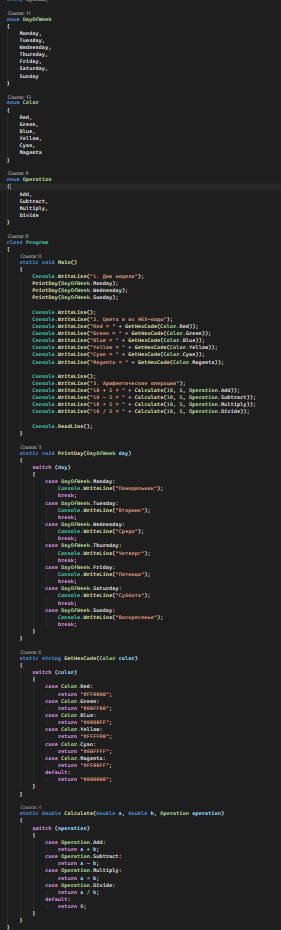
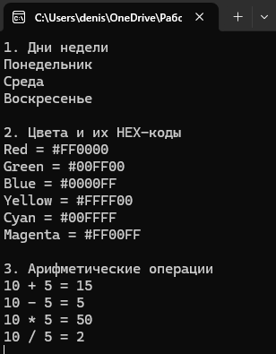

# C# KT6

1. Напишите перечисление DayOfWeek, которое содержит значения для дней недели: Monday, Tuesday, Wednesday, Thursday, Friday, Saturday и Sunday. Затем напишите метод, который принимает на вход значение этого перечисления и выводит на консоль соответствующий день недели на русском языке.

2. Напишите перечисление Color, которое содержит значения для цветов: Red, Green, Blue, Yellow, Cyan и Magenta. Затем напишите метод, который принимает на вход значение этого перечисления и возвращает его шестнадцатеричный код в виде строки.

3. Напишите перечисление Operation, которое содержит значения для арифметических операций: Add, Subtract, Multiply и Divide. Затем напишите метод, который принимает на вход два числа и значение этого перечисления и возвращает результат выполнения соответствующей операции над числами. Прикрепите решение всех задач к этому заданию.

### Код

### Результат

